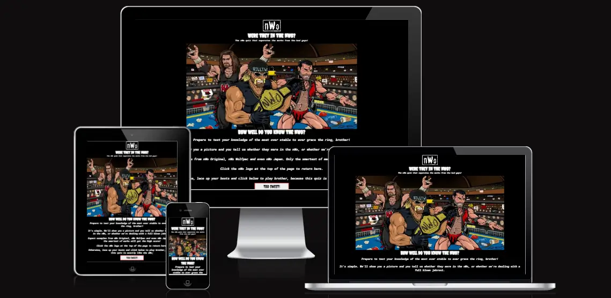
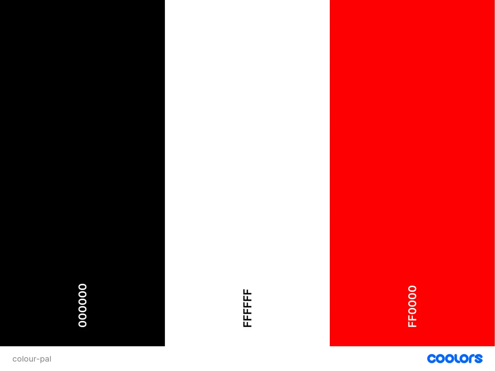
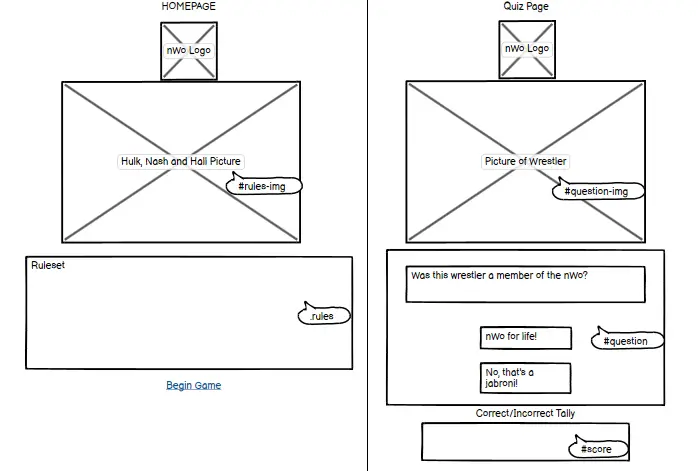
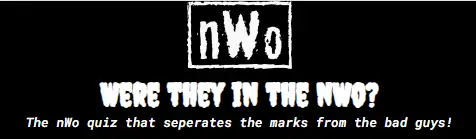
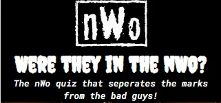
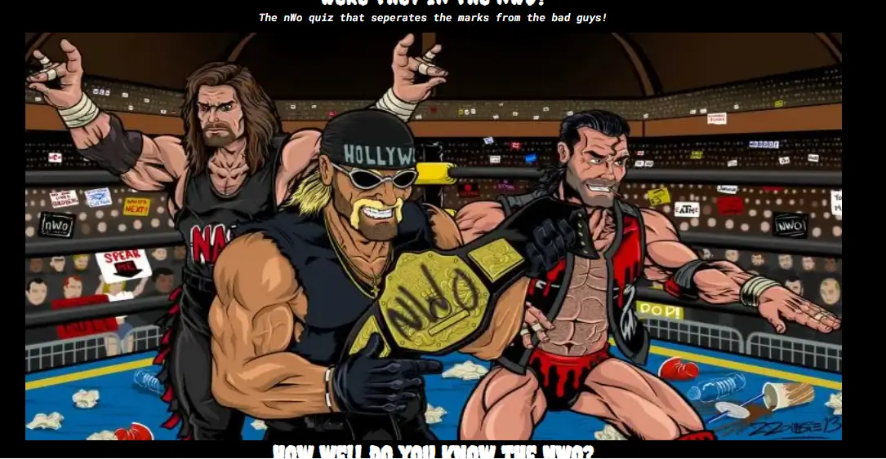
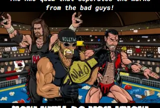

# Were They in the nWo?
Were They in the nWo is a website intended to provide an interactive means of basking in some classic 90's nostalgia. Dedicated to the group that "made wrestling cool", the intention of the site is to provide a fun quiz regarding membership of the eponymous stable to users.

The website is designed to provide the user with a profile and headshot of a persona from this wrestling era and then request that they confirm or deny whether that persona was a member of the nWo. A simple quiz such as this was selected for the foundation of the website as it not only services the niche interest of wrestling fans but also targets thier historical knowledge of same. 

Selection of the subject matter was two-fold; wrestling is currently experiencing a renaissance. New management in WWE has reignited the wrestling industry and many lapsed fans are returning to the product, as indicated by internet traffic and ticket sales. This makes the timing of such a website quite advantageous. Furthermore, many returning fans consider the era of the nWo to be the "peak" of wrestling as a whole. The intention of the website is to capitalise on this nostalgia by drawing traffic and to eventually grow the site to feature other features that hopefully convince new users to visit regularly.

[Deployed website available here](https://adamfcode.github.io/nwo-quiz/) 

# Preparation
Preparation for the project included researching the nWo stable and its sub-groups in order to provide as varied a question pool as possible. The general aesthetic of the stable was also noted for style considerations, as well as canvassing wrestling fans in order to select appropriate wrestling personas and avoid constructing a quiz that was either too easy or too difficult.

## User Stories
* As a user, I wish to test my knowledge of the nWo with an accurate quiz.
* As a user, I want to seamlessly navigate the website without issue.
* As a user, I want a consistent experience that evokes the essence of the subject matter.
* As a user, I want to be informed of how many questions I got correct.

## Colour Palette
A simple palette was decided upon after reviewing the aesthetic of the nWo. Generally presented as black and white, the aesthetic was icnoic throughout the 90's and had a massive influence over wider pop culture in America at that time. Red was then selected as a colour to indicate user interactions, a nod to the red ring-gear worn by the Wolfpac, the most popular sub-section of the nWo in WCW.

### Selected Colour Palette:

## Wireframes
The final presentation of the website mostly matches the wireframes that were mocked up prior to coding. The main difference is in the score tally area. It was decided during the coding process to provide the user with their total score after the quiz had concluded and a username was provided by the user.

### Image of the Wireframes

# Features
## Heading
The classic nWo logo was selected as the heading. Clicking on the logo returns the user to the homepage of the website. Below the logo is the title of the quiz, 'Were They in the nWo?', followed by a tagline that uses wrestling jargon("marks") and nWo-specific merchandising("the bad guys") in order to appeal to wrestling fans.

### Picture of Heading on Desktop

### Picture of Heading on Mobile

## Hero Image
A cartoon depiction of the core three members of the nWo was selected as the hero image. Kevin Nash, Scott Hall and Hulk Hogan were selected as it was decided early on not to feature the three in the quiz itself as they are synonymous with the stable.

### Picture of Hero Image on Desktop

### Picture of Hero Image on Mobile

# Testing

# Deployment

# Credits
