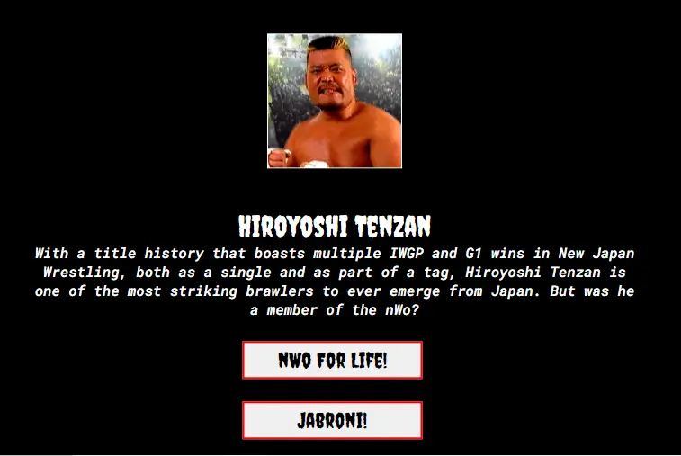
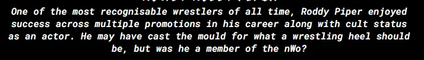
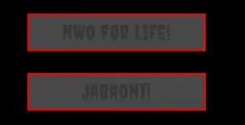
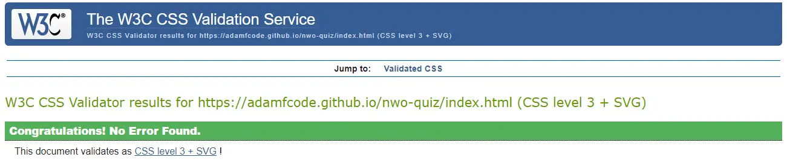

# Were They in the nWo?
Were They in the nWo is a website intended to provide an interactive means of basking in some classic 90's nostalgia. Dedicated to the group that "made wrestling cool", the intention of the site is to provide a fun quiz regarding membership of the eponymous stable to users.

The website is designed to provide the user with a profile and headshot of a persona from this wrestling era and then request that they confirm or deny whether that persona was a member of the nWo. A simple quiz such as this was selected for the foundation of the website as it not only services the niche interest of wrestling fans but also targets their historical knowledge of the industry. 

Selection of the subject matter was two-fold; wrestling is currently experiencing a renaissance. New management in WWE has reignited the wrestling industry and many lapsed fans are returning to the product, as indicated by internet traffic and ticket sales. This makes the timing of such a website quite advantageous. Furthermore, many returning fans consider the era of the nWo to be the "peak" of wrestling as a whole. The intention of the website is to capitalise on this nostalgia by drawing traffic and to eventually grow the site to feature other features that hopefully convince new users to visit regularly.

[Deployed website available here](https://adamfcode.github.io/nwo-quiz/) 

# Preparation
Preparation for the project included researching the nWo stable and its sub-groups in order to provide as varied a question pool as possible. The general aesthetic of the stable was also noted for style considerations, as well as canvassing wrestling fans in order to select appropriate wrestling personas and avoid constructing a quiz that was either too easy or too difficult.

## User Stories
* As a user, I wish to test my knowledge of the nWo with an accurate quiz.
* As a user, I want to seamlessly navigate the website without issue.
* As a user, I want a consistent experience that evokes the essence of the subject matter.
* As a user, I want to be informed of how many questions I got correct.

## Colour Palette
A simple palette was decided upon after reviewing the aesthetic of the nWo. Generally presented as black and white, the aesthetic was iconic throughout the 90's and had a massive influence over wider pop culture in America at that time. Red was then selected as a colour to indicate user interactions, a nod to the red ring-gear worn by the Wolfpac, the most popular sub-section of the nWo in WCW.

### Selected Colour Palette:

## Typography
Creepster, a sans-serif font inspired by gothic imagery, was selected as the font for titles across the website as it was the closest in design to the original nWo font, as seen in the logo.

Roboto Mono, another sans-serif font, was chosen for larger pieces of text in order to maintain legibility against the black background without having to increase the font-size.

## Wireframes
The final presentation of the website mostly matches the wireframes that were mocked up prior to coding. The main difference is in the score tally area. It was decided during the coding process to provide the user with their total score after the quiz had concluded and a username was provided by the user.

### Image of the Wireframes

# Features
## Heading
The classic nWo logo was selected as the heading. Clicking on the logo returns the user to the homepage of the website. Below the logo is the title of the quiz, 'Were They in the nWo?', followed by a tagline that uses standard wrestling jargon ("marks") and nWo-specific jargon ("the bad guys") in order to appeal to wrestling fans.

### Picture of Heading on Desktop

*Note the misspelling of the word 'separates', a typo identified during the writing of the readme. This has been corrected on the website but unfortunately, due to the deadline, the images on the readme still feature the misspelling. The changed text can be viewed on the live deployment as listed at the top of this readme.

### Picture of Heading on Mobile

## Hero Image
A cartoon depiction of the core three members of the nWo was selected as the hero image. Kevin Nash, Scott Hall and Hulk Hogan were selected as it was decided early on not to feature the three in the quiz itself as they are synonymous with the stable.

### Picture of Hero Image on Desktop

### Picture of Hero Image on Mobile

## Ruleset
The ruleset for the quiz features below the hero image and is written to once again use wrestling and nWo-specific jargon. Here, the user is also notified of the interactivity of the logo at the top of the screen. A simple, terse approach was selected in order to not chase away those looking for a quick, casual experience. 

### Picture of Ruleset on Desktop

### Picture of Ruleset on Mobile

## Quiz Button
The button to take users to the quiz page was styled similarly to the aesthetic of the rest of the page. Upon hovering over the button with the cursor, users are treated to a red background in order to pay tribute to the nWo Wolfpac and to also provide a splash of bold colour. The text content of "Too Sweet" was selected as it was the calling card of nWo members when greeting one another. It also allowed the text content of the button to continue on from the ruleset. On selecting this button, the user is brought to the quiz.html page.

### Image of Quiz Button

### Image of Quiz Button on Hover

## Start Button
On load, the quiz page greets user with the same heading as before and a button to start to quiz. This button is styled similarly to the quiz button and also turns red on hover. Selecting this button provides the user with the quiz container in order to play the game.

### Image of Start Button

### Image of Start Button on Hover

## The Quiz
Each question of the quiz provides the user with the following: an image of the persona in question, the name of the persona, a brief summary of their accomplishments and a selection of two answers.

### Image of Quiz on Desktop

### Image of Quiz on Mobile

## Question Subject
The subject of each question is an individual involved with wrestling between the mid-90's and early 00's as this was the time period in which the nWo and its subsidiaries were operational. 

Headshots were chosen for the persona images as they provide uniformity between examples and allows the user to see a clear, unobstructed view of the personas face.

Wrestling personas tend to work under different names throughout their careers. With this in consideration, the names selected were either those most associated with the persona or the name they explicitly used during the relevant era. In some cases, nicknames have also been provided, though only when the nickname is generally acknowledged as part of that personas professional name, e.g. Jushin "Thunder" Liger.

### Image of Question Subject

## Question Text
The text of each question was written as a brief, often tongue-in-cheek description of the persona. Certain terms were used in order to appeal to wrestling fans. The question text is also intended to promote further interest in the persona. Should the user be unfamiliar with the question subject, hopefully the description ignites curiosity and sends the user seeking further information

### Image of Question Text on Desktop

### Image of Question Text on Mobile

## Answer Buttons
The user is presented with two buttons as potential answers, the text content of which is static between questions. This was decided upon as the question itself has only one of two possible answers; either they were a member of the stable or they were not. It also allowed usage of wrestling jargon and emulated the tone of the most famous members. These buttons are styled similarly to the prior buttons and also flash red upon being hovered over. Once a button is selected, both become "greyed out" and can no longer be toggled.

### Image of Answer Buttons

### Image of Answer Buttons on Hover

### Image of Answer Buttons Selected

## Next Button
Upon selecting an answer, a "next" button materialises to allow the user to select the next question. This button is designed to not appear until a question has been answered, disappearing once again until the next question has been answered. It is styled similarly to prior buttons, with a red splash appearing should the user hover over the button. The next button pulls a random question from the array and continues to do so until all questions have been answered.

### Image of Next Button

### Image of Next Button on Hover

## Username Entry
Upon cycling through all of the questions, the user is presented with a congratulations screen once again using the tone of the original nWo members. A field is provided to enter the users name and a button to submit the same. The submit button will not work unless the field has been filled out with some text. The submit button follows the same style precedent of prior buttons, complete with a red splash on hover.

### Image of Username Entry on Desktop

### Image of Username Entry on Mobile

### Image of Username Entry on Hover

### Image of Username Entry with Unfilled Field

## Quiz Complete
Once the quiz has been completed and a username entered, the user is shown a Game Over screen which targets the provided username and provides a final score to the user. A final button, styled similarly to the prior buttons with the same splash of red upon hovering, is presented to the user, allowing them to click and restart the quiz in a cleared state.

### Image of Quiz Complete on Desktop

### Image of Quiz Complete on Mobile

### Image of Restart Button

### Image of Restart Button on Hover

# Abandoned Features

## Running Score Tally
It was decided during development to not track the score on screen while the user plays for two primary reasons. One was to deter users from being surprised by an answer and checking the facts on another website, which may cause the user to forget or lose interest in the quiz. The second reason was to avoid players "learning" the answers as they play and instead to promote the user to cognitively reconsider their answer.

## Answer Feedback
Abandoned for similar reasons to the running score tally, answer feedback also provided a unique issue in the colour scheme of the website. Attempts were made to have correct answers turn "green" and incorrect answers turn "red". The introduction of green to the website would harm the aesthetic, particularly if one is familiar with how the nWo was presented in terms of colour. It also would lead to a clash between incorrect answers and buttons which are being hovered over, providing a jarring experience to users when selecting their answers, as once red became associated with "incorrect" it could cause hesitation when selecting an answer.

## Question Timer
A timer was considered once initial coding began in order to make the most of JavaScript in the project. However, this was quickly abandoned as it was felt it would deter users from truly considering their answers and exploring their knowledge of the nWo. As the provided answers are essentially "yes" or "no", the utility of a timer was also brought into question; beyond the binary choice of yes or no, there were no further considerations that would interact with the increased pressure of a timer and provide further stimulation to the user.
 
# Features Earmarked for Future Implementation
The following features are intended to be implemented at a future date.

## Larger Question Pool
A larger selection of personas to be added, complete with headshots and brief bios, allowing for users to select their total number of questions and to ensure that there is enough content to fill it. This could also allow a selection of questions targeting one specific incarnation of the nWo, e.g. nWo Wolfpac or nWo Japan.

## Leaderboard
The integration of a leaderboard to track user scores and to provide a sense of competition among users. An increased question pool would certainly be required so as to provide large enough variation between user scores. A leaderboard that combines scores across different quizzes on the site would also be included. 

## Expanded Biographies
A section that provides expanded biographies of the personas in the question pool to be added, complete with links to relevant websites. The need for this section arises from the limited space available when posing the question to the user. If the question featured an expanded biography the quiz itself would become quite tedious. For those interested, the planned section would provide an outlet for their curiosity.

## Audio Integration
The nWo had iconic theme music. The opening guitar riff of the theme has reached cult status within wrestling circles and is often used in fan-footage, memes and documentaries. Implementation of just this riff playing upon user interaction is under consideration, with the option to deactivate the feature if the user wishes.

## Ability to Post Score to Social Media
An integrated share function to post scores to social media is to be implemented, in order to increase traffic and engagement. By developing a sense of competition off platform the quiz will attract more users from those platforms. Presumably the users who share their score will have contacts interested in wrestling which serves as a perfect means of advertising to the target audience.

## More Quizzes
Further quizzes to be implemented in order to present a wider variation to users and to provide content for other proposed features. These quizzes would target infamous moments, turns and dates in the nWo's history.

# Testing
A pool of users was invited to test the project across several devices and report any issues. 
The code was observed through the Google Chrome Developer Tools in order to troubleshoot and test alternative code.

## Validator Testing
### HTML
The HTML was tested on the official W3C Validator and showed minor syntax errors. These were corrected and further tests yielded no errors.

#### Image of HTML test on index.html

#### Image of HTML test on quiz.html

### CSS
The CSS was tested on the official Jigsaw Validator and showed no errors.

#### Image of CSS test on index.html

#### Image of CSS test on quiz.html

### JavaScript
The JavaScript was tested on jshint and returned several minor errors and one unresolved issue, documented under bugs. The minor issues were corrected.

#### Image of jshint test on script.js

*Note the unused variable. Issue documented under bugs.

### Responsiveness
The responsivity of both pages was tested on www.responsivedesignchecker.com and though mostly satisfactory, this returned one major issue documented below under bugs.

### Accessibility 
The accessibility of both pages was tested on www.weave.webaim.org and revealed that the logo on each page lacked an aria-label which was then added.

#### Image of Wave test on Index

#### Image of Wave test on Quiz

### Lighthouse Testing
Both pages were tested on Lighthouse, targeting mobile and desktop. The Quiz page returned green scores across both tests. Initially, the performance score of the Homepage on desktop was unsatisfactory. The issue was identified as a delay in loading the fonts. A preconnect was added to the HTML for googlefonts and for gstatic which resolved the issue and returned green scores.

#### Image of Lighthouse Test on index.html for Desktop

#### Image of Lighthouse Test on index.html for Mobile

#### Image of Lighthouse Test on quiz.html for Desktop

#### Image of Lighthouse Test on quiz.html for Desktop

## Bugs
### JavaScript Issue
As noted above, during JavaScript testing the function restartQuiz was returning as an unused variable. The function in question is called in the inner-html of a created div and defined as visible below. Due to project deadlines and the late discovery of this issue, the problem could not be solved and has been earmarked for correction in future.

#### Image of restartQuiz code

### CSS issue
As noted above, during CSS testing an issue was discovered where certain mobile viewports created a large gap between the heading and the headshot of personas in question. This led to the website appearing "blank" if not scrolled down on certain mobiles. Several media queries were implemented, tested and abandoned in order to target this issue with mixed results. Due to project deadlines and the late discovery of this issue, the problem could not be solved and was earmarked for correction in future.

# Deployment
The deployment was conducted on github using the following steps:
* On the repository screen select settings.
* Select pages from the menu on the left.
* Select source and choose to deploy from branch.
* Set branch to main-root.
* Click save which provides the deployment link, available at the top of this readme.

# Credits
## Written Reference Sources
The listed websites were consulted regularly during this project.
* https://www.w3schools.com/
* https://stackoverflow.com/
* https://www.shecodes.io/
* https://www.hackr.io/

## Video Reference Sources
The listed YouTube channels were consulted regularly during the project
* Keith Paterson: https://www.youtube.com/@kpatelearn
* James Q Quick: https://www.youtube.com/@JamesQQuick
* Great Stack: https://www.youtube.com/@GreatStackDev
* Brian Design: https://www.youtube.com/@briandesign

## Learning Materials
The learning materials, video tutorials and modules provided by codeinstitute were consulted regularly during the project.

## Abandoned Repository
The project was initially started on a different repository where early errors in the code resulted in sweeping issues later in the coding process. Due to this, the commits on the project became bloated, confusing and inconcise. The decision was made to abandon the repository and salvage the code that worked and use it in a new repository where the coding process could be more accurately documented and any confusion with the code avoided. The repository in question is on the same github page and is available to view here: https://github.com/AdamFcode/Were-They-nWo 

## Images
* The nWo logo used in the heading provided by ProWrestlingRenders on Deviantart
* The splash image of Hogan, Nash and Hall in ring provided by ZZoMBiEXIII on Deviantart
* All Wrestler images were sourced from the Ruthless Aggression Mod for Total Extreme Wrestling 2020. Originally designed by Idol for Total Extreme Wrestling 2016, the edition used for this project was adapted and updated by MrVillain.

## Text Content
The text content of the ruleset, headings, questions and all other content was written by the programmer. The readme was spellchecked using Microsoft Word.

# Acknowledgement
With appreciation for aid lent by the project mentor and class CI provided by codeinstitue as well as fellow students in the slack channel.
